---
hide:
  - navigation
  - toc
---

# Select debuff

=== "{ .off-glb }"

    === "First jump   pattern"

    === "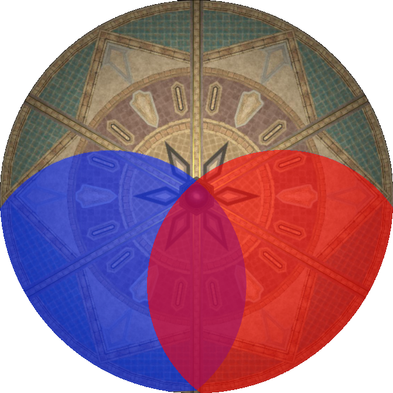{ width="100" .off-glb }"
         
        The following table displays where to stand, and the resulting temperature after each jump.  
        These positions have been optimized to minimize movement allowing DPS uptime.  
        **Recommended distance**: Outer edge target hitbox.

        | | Jump 1 | Jump 2 | Jump 3 | Jump 4 |
        |-|:-:|:-:|:-:|:-:|
        | Visual | 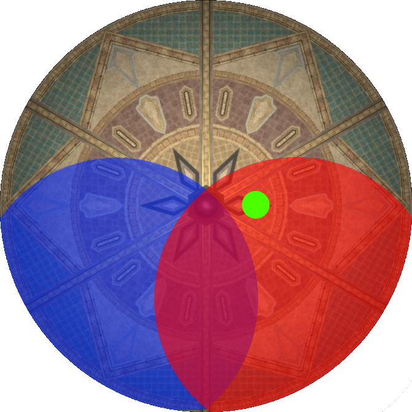{ width="150" } | 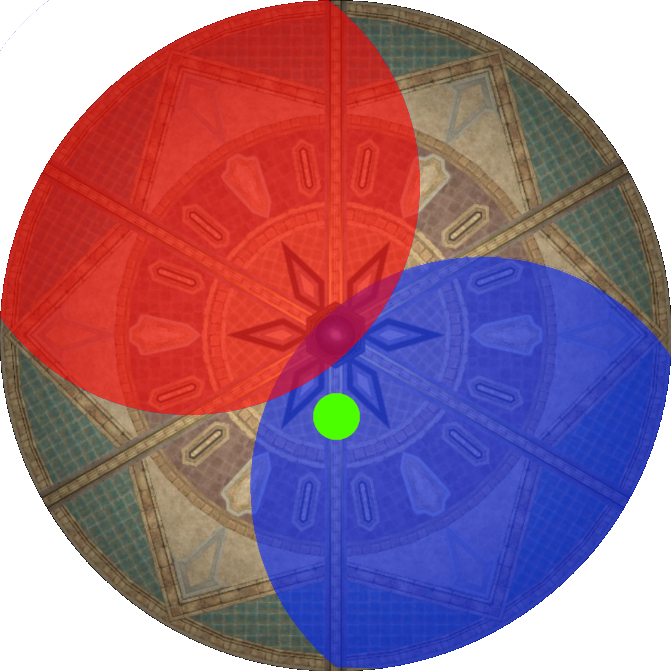{ width="150" } | 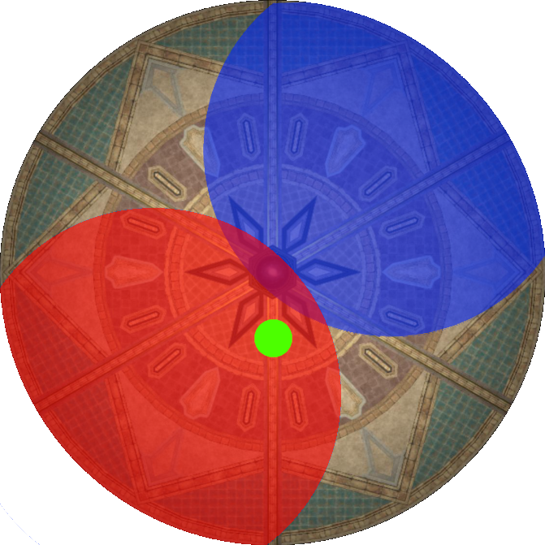{ width="150" } | 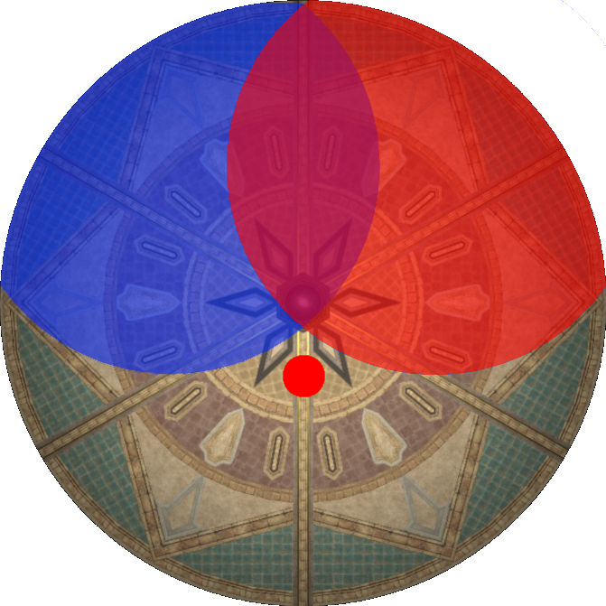{ width="150" } |
        | Position | ++right++ | ++down++ | ++down++ | ++down++ |
        | Hit by | Fire | Ice | Fire | Nothing |
        | Result | Neutral | Ice +1 | Neutral | Neutral |

        <!-- [Reset](http://localhost:8000/){ .md-button .md-button--primary } -->

    === "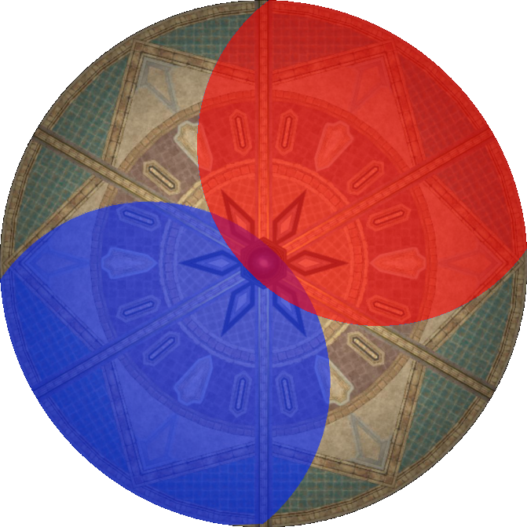{ width="100" .off-glb }"
         
        The following table displays where to stand, and the resulting temperature after each jump.  
        These positions have been optimized to minimize movement allowing DPS uptime.  
        **Recommended distance**: Outer edge target hitbox.

        | | Jump 1 | Jump 2 | Jump 3 | Jump 4 |
        |-|:-:|:-:|:-:|:-:|
        | Visual | 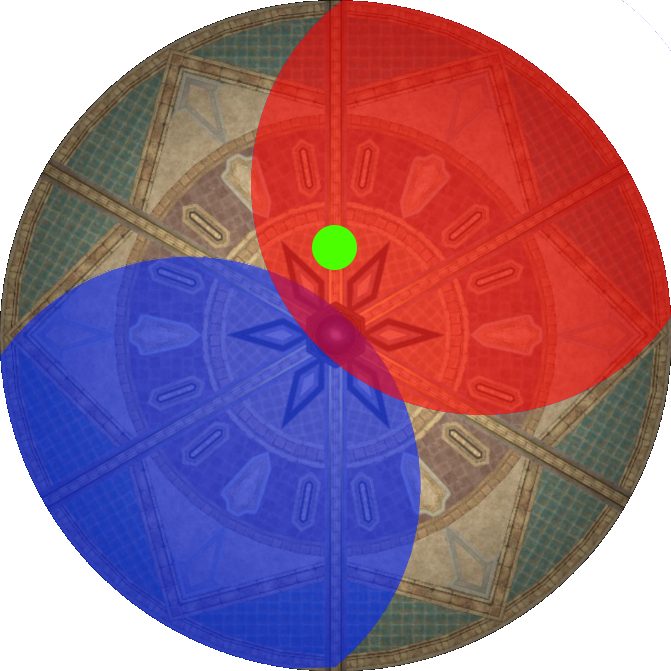{ width="150" } | 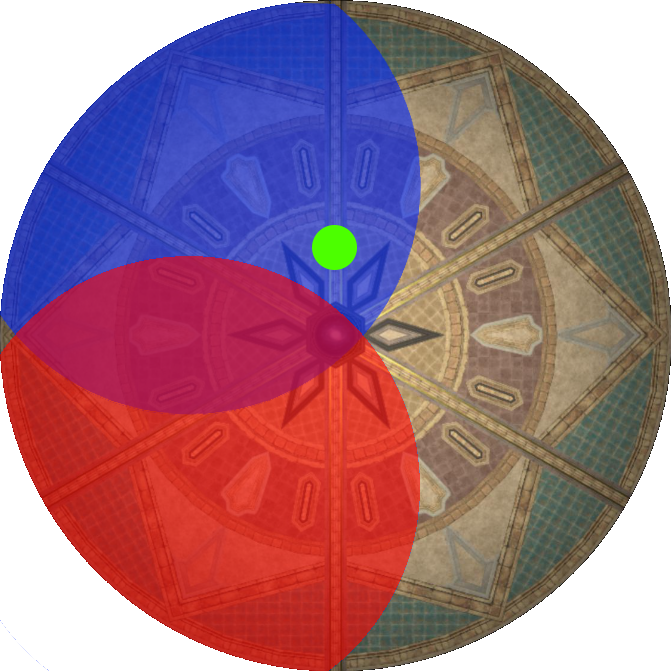{ width="150" } | 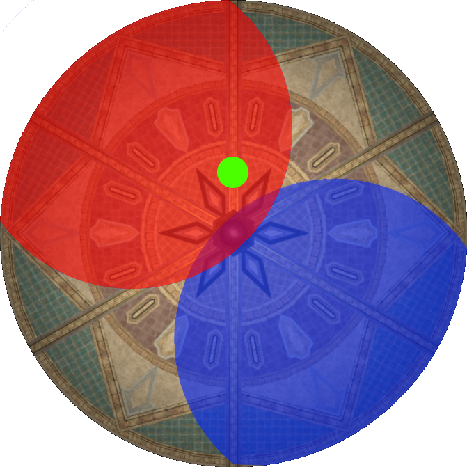{ width="150" } | 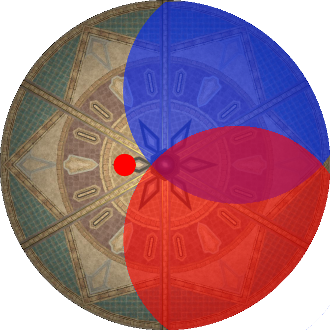{ width="150" } |
        | Position | ++up++ | ++up++ | ++up++ | ++left++ |
        | Hit by | Fire | Ice | Fire | Nothing |
        | Result | Neutral | Ice +1 | Neutral | Neutral |

    === "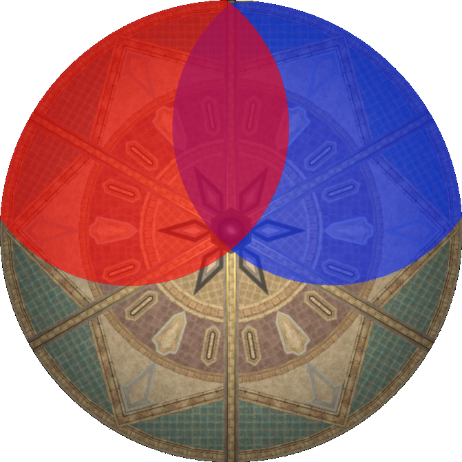{ width="100" .off-glb }"
         
        The following table displays where to stand, and the resulting temperature after each jump.  
        These positions have been optimized to minimize movement allowing DPS uptime.  
        **Recommended distance**: Outer edge target hitbox.

        | | Jump 1 | Jump 2 | Jump 3 | Jump 4 |
        |-|:-:|:-:|:-:|:-:|
        | Visual | 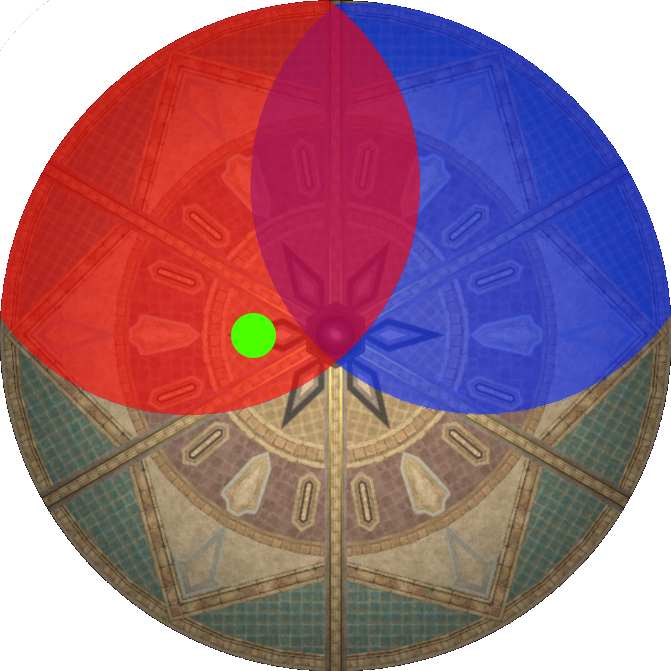{ width="150" } | { width="150" } | 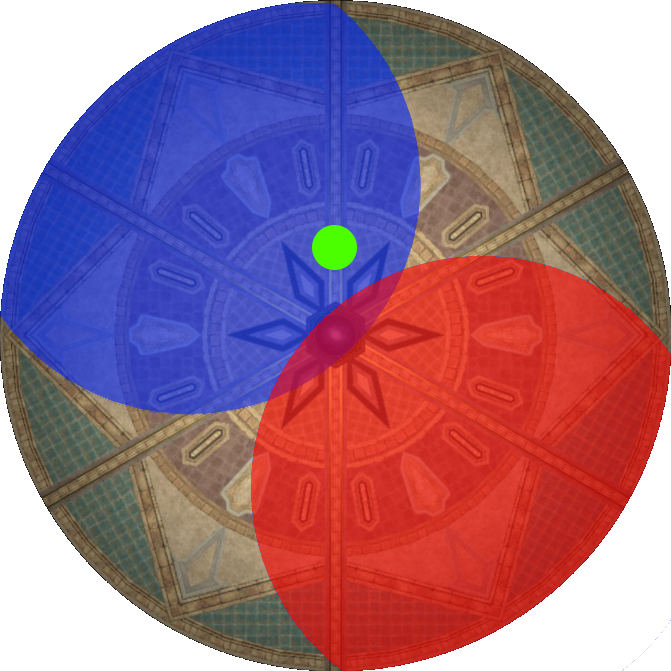{ width="150" } | 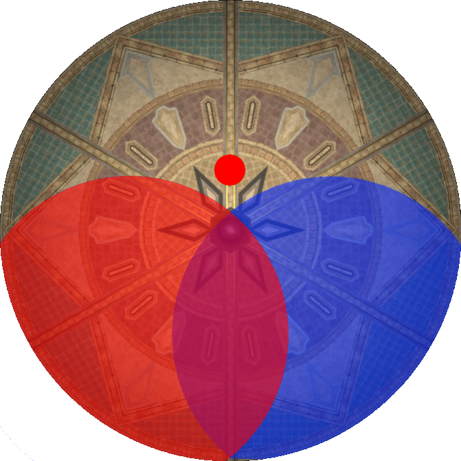{ width="150" } |
        | Position | ++left++ | ++up++ | ++up++ | ++up++ |
        | Hit by | Fire | Ice | Fire | Nothing |
        | Result | Neutral | Ice +1 | Neutral | Neutral |

        <!-- { width="600" } -->

    === "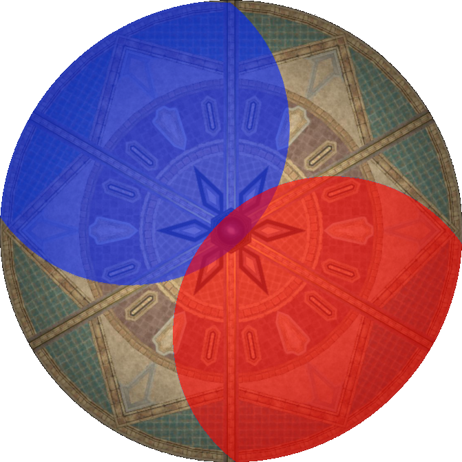{ width="100" .off-glb }"
         
        The following table displays where to stand, and the resulting temperature after each jump.  
        These positions have been optimized to minimize movement allowing DPS uptime.  
        **Recommended distance**: Outer edge target hitbox.

        | | Jump 1 | Jump 2 | Jump 3 | Jump 4 |
        |-|:-:|:-:|:-:|:-:|
        | Visual | 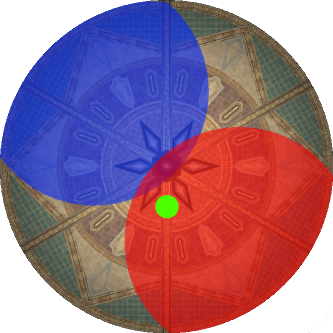{ width="150" } | 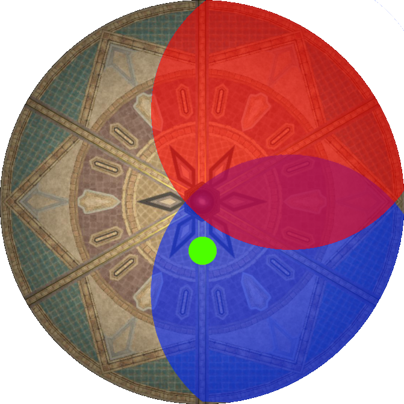{ width="150" } | { width="150" } | 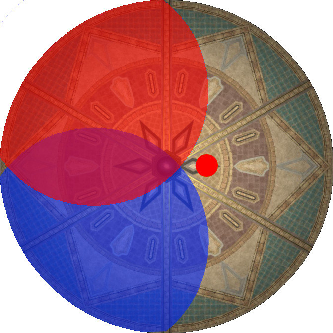{ width="150" } |
        | Position | ++down++ | ++down++ |++down++ | ++right++ |
        | Hit by | Fire | Ice | Fire | Nothing |
        | Result | Neutral | Ice +1 | Neutral | Neutral |

        <!-- { width="600" } -->

=== "{ .off-glb }"

    === "First jump   pattern"

    === "{ width="100" .off-glb }"
         
        The following table displays where to stand, and the resulting temperature after each jump.  
        These positions have been optimized to minimize movement allowing DPS uptime.  
        **Recommended distance**: Outer edge target hitbox.

        | | Jump 1 | Jump 2 | Jump 3 | Jump 4 |
        |-|:-:|:-:|:-:|:-:|
        | Visual | 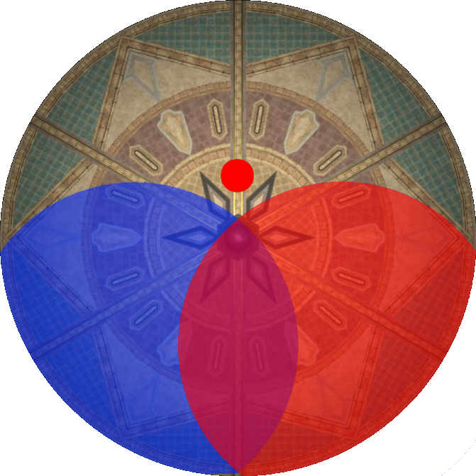{ width="150" } | 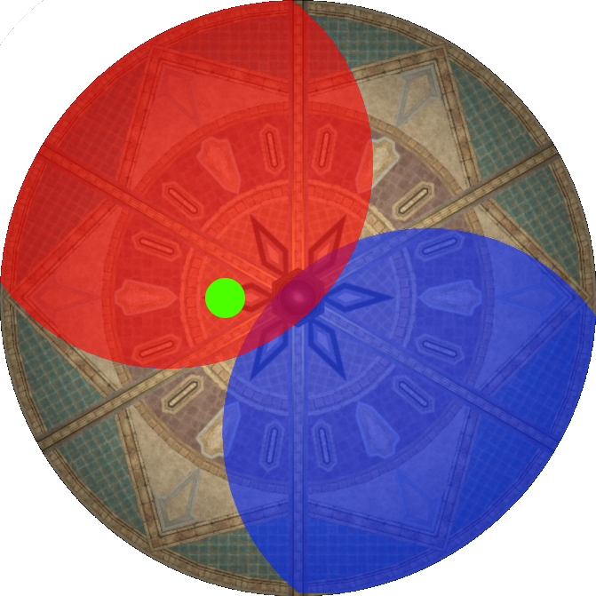{ width="150" } | 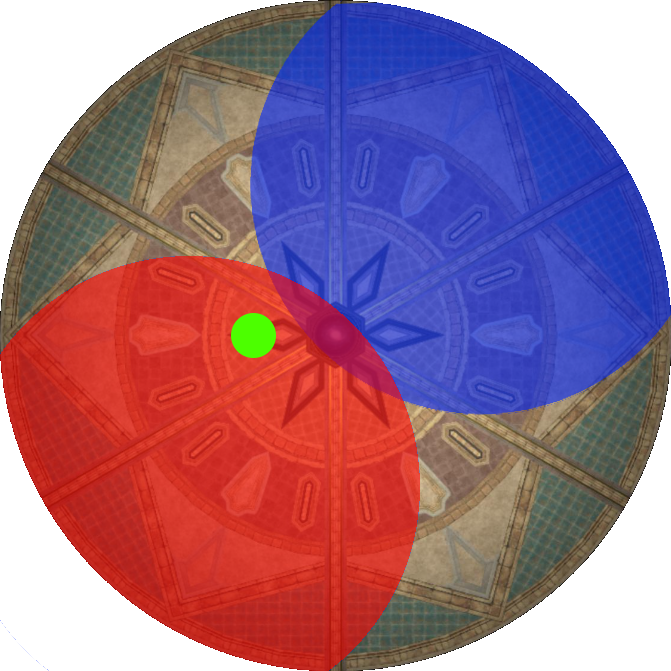{ width="150" } | { width="150" } |
        | Position | ++up++ | ++left++ | ++left++ | ++down++ |
        | Hit by | Nothing | Fire | Fire | Nothing |
        | Result | Ice +2 | Ice +1 | Neutral | Neutral |

    === "{ width="100" .off-glb }"
         
        The following table displays where to stand, and the resulting temperature after each jump.  
        These positions have been optimized to minimize movement allowing DPS uptime.  
        **Recommended distance**: Outer edge target hitbox.

        | | Jump 1 | Jump 2 | Jump 3 | Jump 4 |
        |-|:-:|:-:|:-:|:-:|
        | Visual | { width="150" } | { width="150" } | { width="150" } | 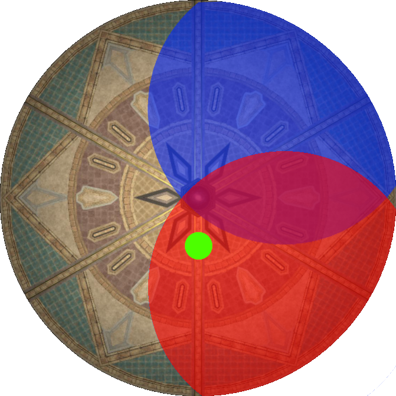{ width="150" } |
        | Position | ++up++ | ++up++ | ++up++ | ++down++ |
        | Hit by | Fire | Ice | Fire | Fire |
        | Result | Ice +1 | Ice +2 | Ice +1 | Neutral |

    === "{ width="100" .off-glb }"
         
        The following table displays where to stand, and the resulting temperature after each jump.  
        These positions have been optimized to minimize movement allowing DPS uptime.  
        **Recommended distance**: Outer edge target hitbox.

        | | Jump 1 | Jump 2 | Jump 3 | Jump 4 |
        |-|:-:|:-:|:-:|:-:|
        | Visual | 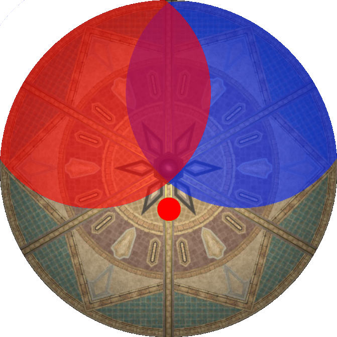{ width="150" } | 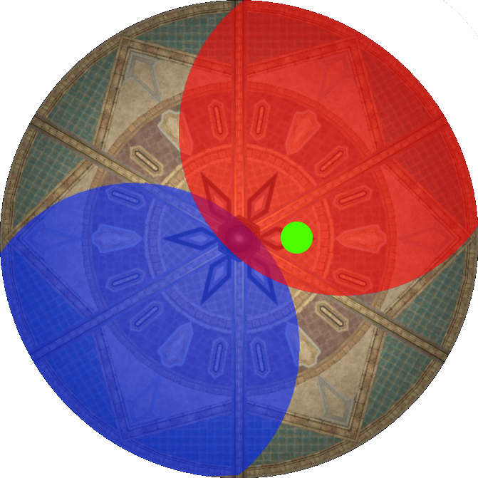{ width="150" } | 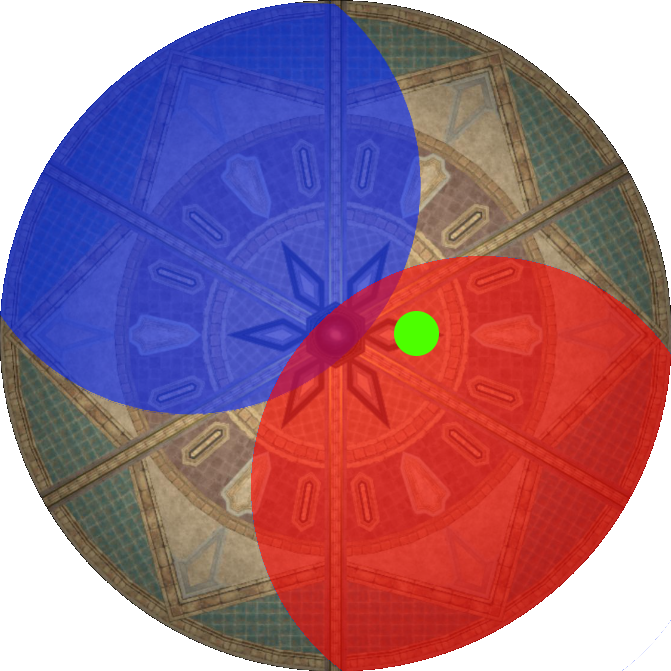{ width="150" } | { width="150" } |
        | Position | ++down++ | ++right++ | ++right++ | ++up++ |
        | Hit by | Nothing | Fire | Fire | Nothing |
        | Result | Ice +2 | Ice +1 | Neutral | Neutral |

    === "{ width="100" .off-glb }"
         
        The following table displays where to stand, and the resulting temperature after each jump.  
        These positions have been optimized to minimize movement allowing DPS uptime.  
        **Recommended distance**: Outer edge target hitbox.

        | | Jump 1 | Jump 2 | Jump 3 | Jump 4 |
        |-|:-:|:-:|:-:|:-:|
        | Visual | { width="150" } | { width="150" } | { width="150" } | 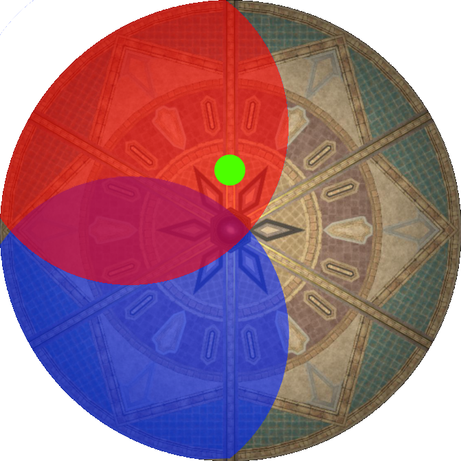{ width="150" } |
        | Position | ++down++ | ++down++ | ++down++ | ++up++ |
        | Hit by | Fire | Ice | Fire | Fire |
        | Result | Ice +1 | Ice +2 | Ice +1 | Neutral |

=== "{ .off-glb }"

    === "First jump   pattern"

    === "{ width="100" .off-glb }"
         
        The following table displays where to stand, and the resulting temperature after each jump.  
        These positions have been optimized to minimize movement allowing DPS uptime.  
        **Recommended distance**: Outer edge target hitbox.

        | | Jump 1 | Jump 2 | Jump 3 | Jump 4 |
        |-|:-:|:-:|:-:|:-:|
        | Visual | { width="150" } | { width="150" } | { width="150" } | { width="150" } |
        | Position | ++right++ | ++left++ | ++left++ | ++down++ |
        | Hit by | Fire | Fire | Fire | Nothing |
        | Result | Ice +2 | Ice +1 | Neutral | Neutral |

    === "{ width="100" .off-glb }"
         
        The following table displays where to stand, and the resulting temperature after each jump.  
        These positions have been optimized to minimize movement allowing DPS uptime.  
        **Recommended distance**: Outer edge target hitbox.

        | | Jump 1 | Jump 2 | Jump 3 | Jump 4 |
        |-|:-:|:-:|:-:|:-:|
        | Visual | { width="150" } | 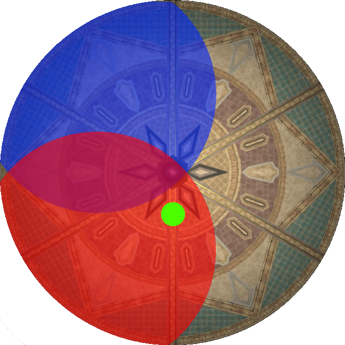{ width="150" } | { width="150" } | { width="150" } |
        | Position | ++right++ | ++down++ | ++left++ | ++left++ |
        | Hit by | Fire | Fire | Fire | Nothing |
        | Result | Ice +2 | Ice +1 | Neutral | Neutral |

    === "{ width="100" .off-glb }"
         
        The following table displays where to stand, and the resulting temperature after each jump.  
        These positions have been optimized to minimize movement allowing DPS uptime.  
        **Recommended distance**: Outer edge target hitbox.

        | | Jump 1 | Jump 2 | Jump 3 | Jump 4 |
        |-|:-:|:-:|:-:|:-:|
        | Visual | { width="150" } | { width="150" } | { width="150" } | { width="150" } |
        | Position | ++left++ | ++right++ | ++right++ | ++up++ |
        | Hit by | Fire | Fire | Fire | Nothing |
        | Result | Ice +2 | Ice +1 | Neutral | Neutral |

    === "{ width="100" .off-glb }"
         
        The following table displays where to stand, and the resulting temperature after each jump.  
        These positions have been optimized to minimize movement allowing DPS uptime.  
        **Recommended distance**: Outer edge target hitbox.

        | | Jump 1 | Jump 2 | Jump 3 | Jump 4 |
        |-|:-:|:-:|:-:|:-:|
        | Visual | { width="150" } | 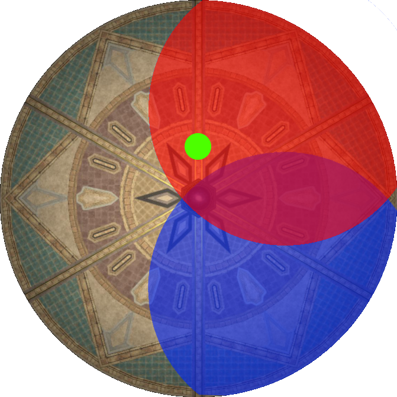{ width="150" } | { width="150" } | { width="150" } |
        | Position | ++right++ | ++up++ | ++left++ | ++right++ |
        | Hit by | Fire | Fire | Fire | Nothing |
        | Result | Ice +2 | Ice +1 | Neutral | Neutral |

=== "{ .off-glb }"

    === "First jump   pattern"

    === "{ width="100" .off-glb }"
         
        The following table displays where to stand, and the resulting temperature after each jump.  
        These positions have been optimized to minimize movement allowing DPS uptime.  
        **Recommended distance**: Outer edge target hitbox.

        | | Jump 1 | Jump 2 | Jump 3 | Jump 4 |
        |-|:-:|:-:|:-:|:-:|
        | Visual | 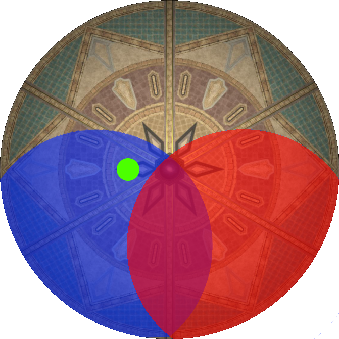{ width="150" } | { width="150" } | { width="150" } | { width="150" } |
        | Position | ++left++ | ++down++ | ++down++ | ++down++ |
        | Hit by | Ice | Ice | Fire | Nothing |
        | Result | Neutral | Ice +1 | Neutral | Neutral |

    === "{ width="100" .off-glb }"
         
        The following table displays where to stand, and the resulting temperature after each jump.  
        These positions have been optimized to minimize movement allowing DPS uptime.  
        **Recommended distance**: Outer edge target hitbox.

        | | Jump 1 | Jump 2 | Jump 3 | Jump 4 |
        |-|:-:|:-:|:-:|:-:|
        | Visual | 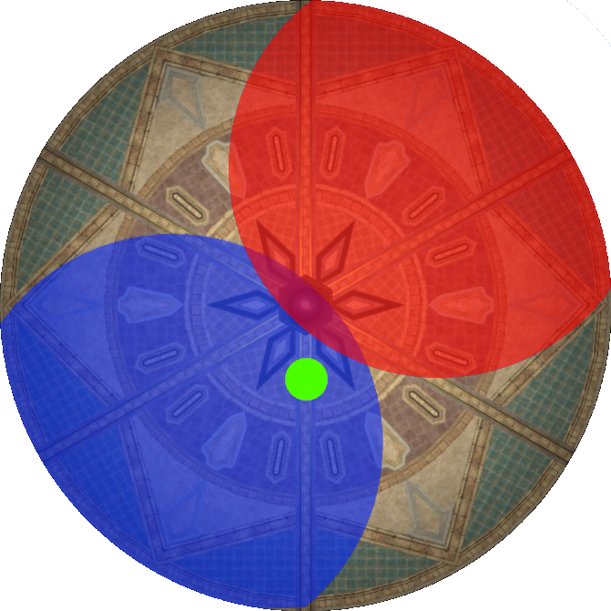{ width="150" } | { width="150" } | { width="150" } | { width="150" } |
        | Position | ++down++ | ++down++ | ++down++ | ++left++ |
        | Hit by | Ice | Fire | Ice | Nothing |
        | Result | Neutral | Fire +1 | Neutral | Neutral |

    === "{ width="100" .off-glb }"
         
        The following table displays where to stand, and the resulting temperature after each jump.  
        These positions have been optimized to minimize movement allowing DPS uptime.  
        **Recommended distance**: Outer edge target hitbox.

        | | Jump 1 | Jump 2 | Jump 3 | Jump 4 |
        |-|:-:|:-:|:-:|:-:|
        | Visual | 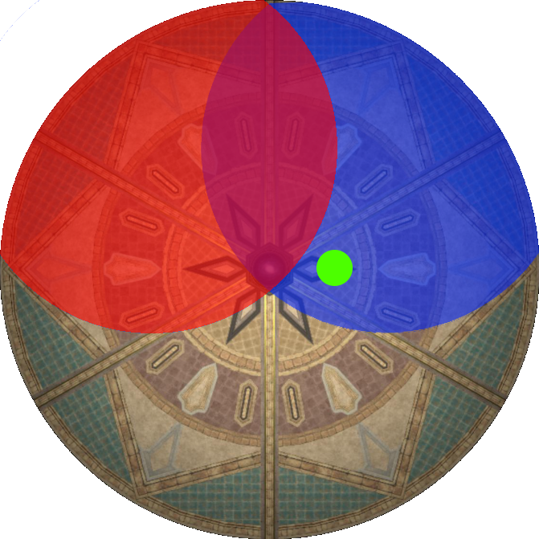{ width="150" } | { width="150" } | { width="150" } | { width="150" } |
        | Position | ++right++ | ++up++ | ++up++ | ++up++ |
        | Hit by | Ice | Fire | Ice | Nothing |
        | Result | Neutral | Fire +1 | Neutral | Neutral |

    === "{ width="100" .off-glb }"
         
        The following table displays where to stand, and the resulting temperature after each jump.  
        These positions have been optimized to minimize movement allowing DPS uptime.  
        **Recommended distance**: Outer edge target hitbox.

        | | Jump 1 | Jump 2 | Jump 3 | Jump 4 |
        |-|:-:|:-:|:-:|:-:|
        | Visual | { width="150" } | { width="150" } | 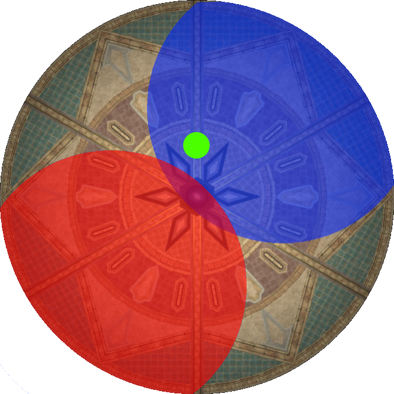{ width="150" } | { width="150" } |
        | Position | ++up++ | ++up++ | ++up++ | ++right++ |
        | Hit by | Ice | Fire | Ice | Nothing |
        | Result | Neutral | Fire +1 | Neutral | Neutral |

=== "{ .off-glb }"

    === "First jump   pattern"

    === "{ width="100" .off-glb }"
         
        The following table displays where to stand, and the resulting temperature after each jump.  
        These positions have been optimized to minimize movement allowing DPS uptime.  
        **Recommended distance**: Outer edge target hitbox.

        | | Jump 1 | Jump 2 | Jump 3 | Jump 4 |
        |-|:-:|:-:|:-:|:-:|
        | Visual | { width="150" } | 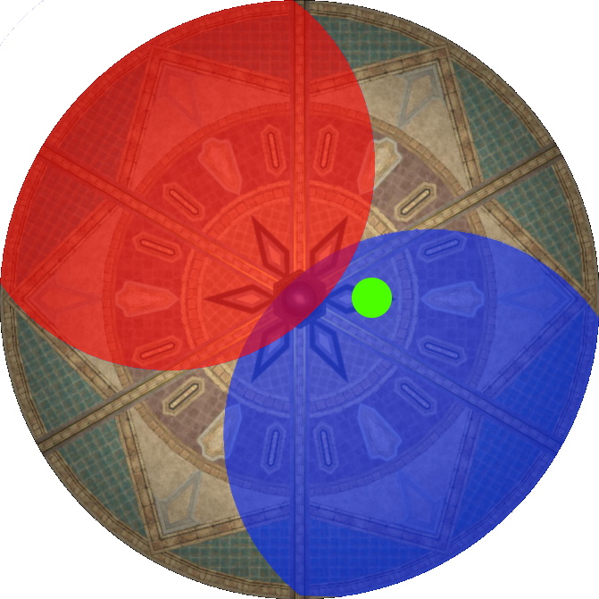{ width="150" } | 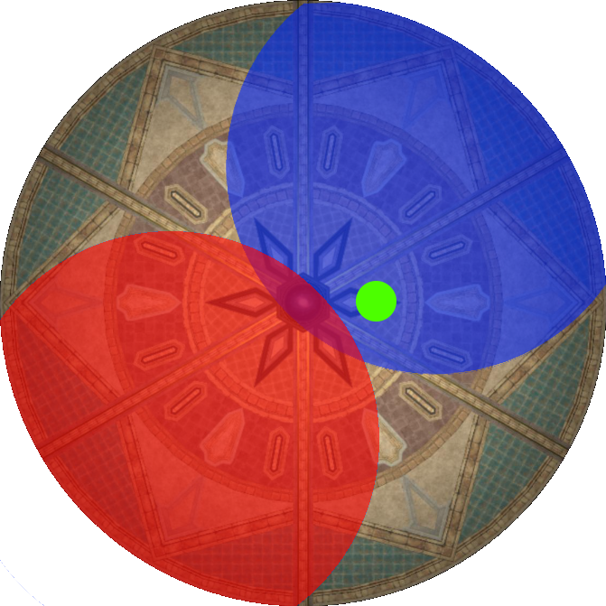{ width="150" } | { width="150" } |
        | Position | ++up++ | ++right++ | ++right++ | ++down++ |
        | Hit by | Nothing | Ice | Ice | Nothing |
        | Result | Fire +2 | Fire +1 | Neutral | Neutral |

    === "{ width="100" .off-glb }"
         
        The following table displays where to stand, and the resulting temperature after each jump.  
        These positions have been optimized to minimize movement allowing DPS uptime.  
        **Recommended distance**: Outer edge target hitbox.

        | | Jump 1 | Jump 2 | Jump 3 | Jump 4 |
        |-|:-:|:-:|:-:|:-:|
        | Visual | { width="150" } | { width="150" } | { width="150" } | 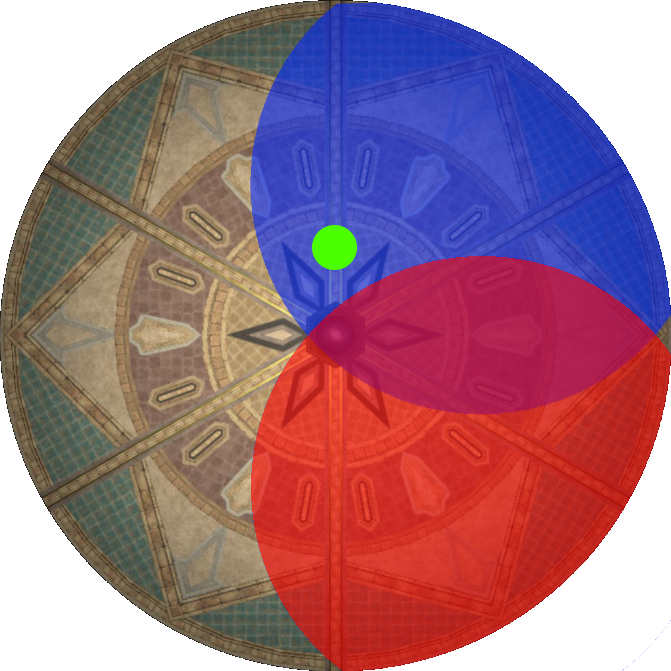{ width="150" } |
        | Position | ++down++ | ++down++ | ++down++ | ++up++ |
        | Hit by | Ice | Fire | Ice | Ice |
        | Result | Fire +1 | Fire +2 | Fire +1 | Neutral |

    === "{ width="100" .off-glb }"
         
        The following table displays where to stand, and the resulting temperature after each jump.  
        These positions have been optimized to minimize movement allowing DPS uptime.  
        **Recommended distance**: Outer edge target hitbox.

        | | Jump 1 | Jump 2 | Jump 3 | Jump 4 |
        |-|:-:|:-:|:-:|:-:|
        | Visual | { width="150" } | { width="150" } | 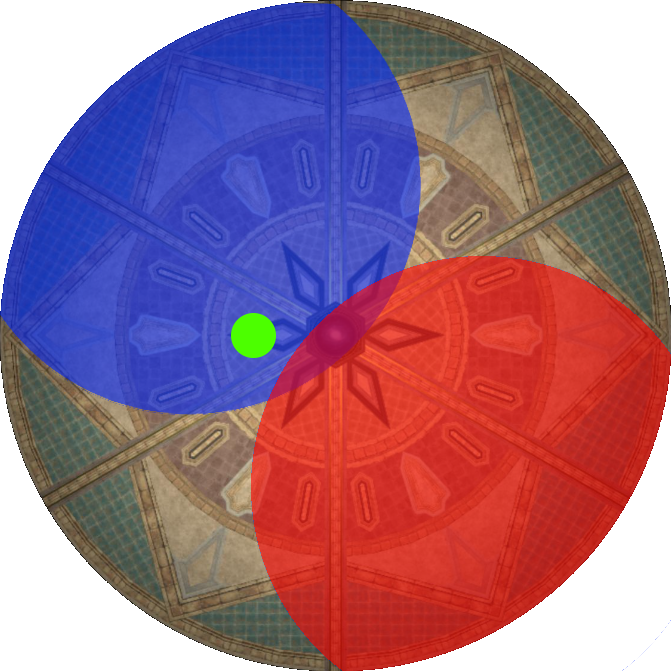{ width="150" } | { width="150" } |
        | Position | ++down++ | ++down++ | ++left++ | ++up++ |
        | Hit by | Nothing | Ice | Ice | Nothing |
        | Result | Fire +2| Fire +1 | Neutral | Neutral |

    === "{ width="100" .off-glb }"
         
        The following table displays where to stand, and the resulting temperature after each jump.  
        These positions have been optimized to minimize movement allowing DPS uptime.  
        **Recommended distance**: Outer edge target hitbox.

        | | Jump 1 | Jump 2 | Jump 3 | Jump 4 |
        |-|:-:|:-:|:-:|:-:|
        | Visual | { width="150" } | { width="150" } | { width="150" } | 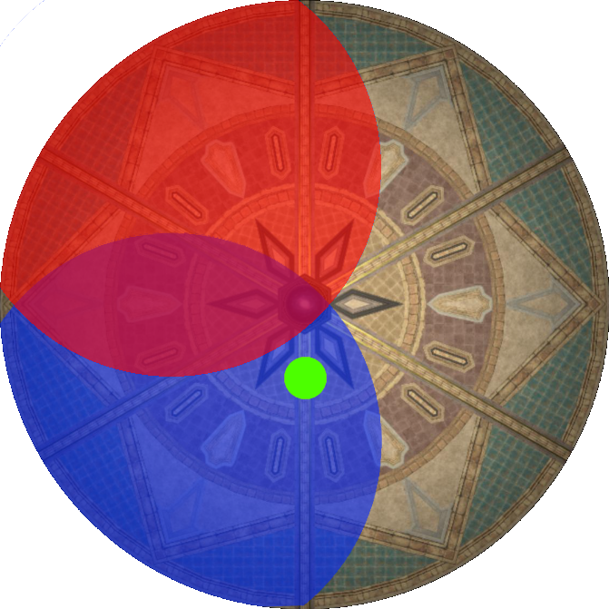{ width="150" } |
        | Position | ++up++ | ++up++ | ++up++ | ++down++ |
        | Hit by | Ice | Fire | Ice | Ice |
        | Result | Fire +1| Fire +2 | Fire +1 | Neutral |

=== "{ .off-glb }"

    === "First jump   pattern"

    === "{ width="100" .off-glb }"
         
        The following table displays where to stand, and the resulting temperature after each jump.  
        These positions have been optimized to minimize movement allowing DPS uptime.  
        **Recommended distance**: Outer edge target hitbox.

        | | Jump 1 | Jump 2 | Jump 3 | Jump 4 |
        |-|:-:|:-:|:-:|:-:|
        | Visual | { width="150" } | { width="150" } | { width="150" } | { width="150" } |
        | Position | ++left++ | ++right++ | ++right++ | ++down++ |
        | Hit by | Ice | Ice | Ice | Nothing |
        | Result | Fire +2| Fire +1 | Neutral | Neutral |

    === "{ width="100" .off-glb }"
         
        The following table displays where to stand, and the resulting temperature after each jump.  
        These positions have been optimized to minimize movement allowing DPS uptime.  
        **Recommended distance**: Outer edge target hitbox.

        | | Jump 1 | Jump 2 | Jump 3 | Jump 4 |
        |-|:-:|:-:|:-:|:-:|
        | Visual | { width="150" } | 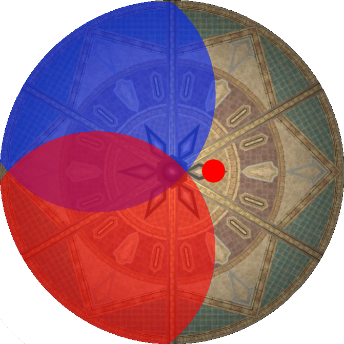{ width="150" } | { width="150" } | { width="150" } |
        | Position | ++down++ | ++right++ | ++right++ | ++up++ |
        | Hit by | Ice | Nothing | Ice | Ice |
        | Result | Fire +2| Fire +2 | Fire +1 | Neutral |

    === "{ width="100" .off-glb }"
         
        The following table displays where to stand, and the resulting temperature after each jump.  
        These positions have been optimized to minimize movement allowing DPS uptime.  
        **Recommended distance**: Outer edge target hitbox.

        | | Jump 1 | Jump 2 | Jump 3 | Jump 4 |
        |-|:-:|:-:|:-:|:-:|
        | Visual | { width="150" } | 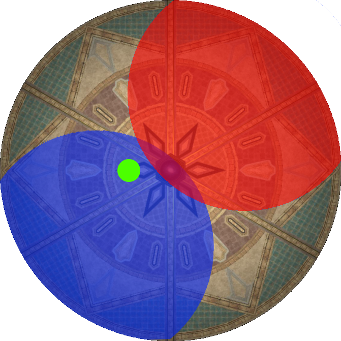{ width="150" } | { width="150" } | { width="150" } |
        | Position | ++right++ | ++left++ | ++left++ | ++up++ |
        | Hit by | Ice | Ice | Ice | Nothing |
        | Result | Fire +2| Fire +1 | Neutral | Neutral |

    === "{ width="100" .off-glb }"
         
        The following table displays where to stand, and the resulting temperature after each jump.  
        These positions have been optimized to minimize movement allowing DPS uptime.  
        **Recommended distance**: Outer edge target hitbox.

        | | Jump 1 | Jump 2 | Jump 3 | Jump 4 |
        |-|:-:|:-:|:-:|:-:|
        | Visual | { width="150" } | { width="150" } | { width="150" } | { width="150" } |
        | Position | ++left++ | ++down++ | ++right++ | ++right++ |
        | Hit by | Ice | Ice | Ice | Nothing |
        | Result | Fire +2| Fire +1 | Neutral | Neutral |
